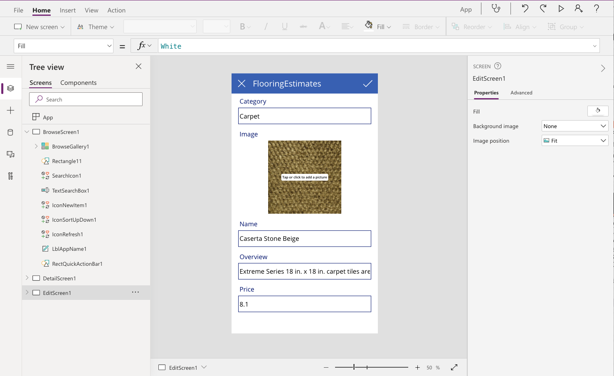
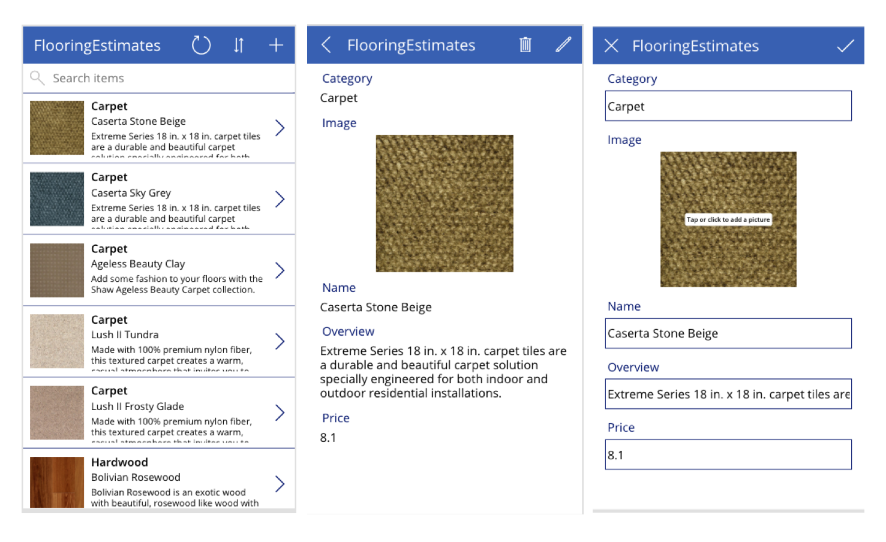

# Getting Started With Power Apps

This article summarizes my learnings from completing the [Get Started With Power Apps](https://docs.microsoft.com/en-us/learn/modules/get-started-with-powerapps/?WT.mc_id=mobile-18099-ninarasi) module, the first of three modules in the [Create a canvas in Power Apps](https://docs.microsoft.com/en-us/learn/paths/create-powerapps/?WT.mc_id=mobile-18099-ninarasi) learning path. Follow this [2021 - Power Apps Learn](https://docs.microsoft.com/en-us/users/nityan/collections/z2xwsxy4go3mpj?WT.mc_id=mobile-18099-ninarasi) collection to track my learning journey!

## Sketchnote Summary

Below is the sketchnote summary of the entire module! Take a quick look before we dive in. I'll wait! You can also save the image to your local drive, or print it out, to get a hi-res version (4K) as a handy reference for future review.

I'll capture my learnings below, but if you want to get an interactive hands-on tutorial for this, I recommend [this session](https://channel9.msdn.com/Shows/Learn-Live/Learn-Live--Ignite-Get-started-with-Power-Apps?) that was recently recorded for the #LearnLive series at Microsoft Ignite.

## Deep Dive

The module answers the following questions. I've added brief notes that provide a sense of the key takeaways I had from each unit of the module. The units are linked to each question for quick lookup if needed.

### 1. [What is Power Apps?](https://docs.microsoft.com/en-us/learn/modules/get-started-with-powerapps/1-powerapps-introduction?WT.mc_id=mobile-18099-ninarasi)

 * A suite of apps, services, and connectors 
 * with an underlying data platform 
 * that helps you build custom apps for your business needs
 * in a low-code environment (visually)

### 2. [What are Power Apps Building Blocks?](https://docs.microsoft.com/en-us/learn/modules/get-started-with-powerapps/2-powerapps-building-blocks?WT.mc_id=mobile-18099-ninarasi)

 * Power Apps Home Page | `make.powerapps.com`
 * Power Apps Studio | `preview.create.powerapps.com/studio`
 * Power Apps Mobile | `powerapps.microsoft.com/downloads/`
 * Power Platform Admin Center | `admin.powerplatform.microsoft.com`

The [Power Apps Home Page](https://make.powerapps.com) is the "lobby" for your Power Platform development environment. From here you can go to 
 * `Learn` for help and training, 
 * `Apps` to see created/deployed apps (search for yours by filtering), 
 * `Create` to start creating a new app, 
 * `Data` for data-related actions,
 * `Flows` (Power Automate), 
 * `Chatbots` (Power Virtual Agents),
 * `AI Builder`(integrate tailored AI models)

Once you've created an app, the [Power Apps Studio](https://preview.create.powerapps.com/studio/) provides an interactive 3-panel window with a Tree view (left), an App UI preview (center) and a Screen details view (right).  The tree view shows all the screens that exist in your app, and the components (tree) that make up each screen. Selecting a screen or component in the left pane will highlight the corresponding UI element in the middle, and allow you to update its properties on the right. **Now, building your app is as simple as adding/removing components, attaching them to data sources, and configuring their properties - through a visual interface!**.

### 3. [Three ways to build Power Apps](https://docs.microsoft.com/en-us/learn/modules/get-started-with-powerapps/4-powerapps-ways-to-build?WT.mc_id=mobile-18099-ninarasi)

Click the `Create` option in the [Power Apps Home Page](https://make.preview.powerapps.com/). You get three options to build an app:
 * _Blank Page_ / build canvas, model-driven, or portal, app - from scratch!
 * _From Data_ / import data source, get automatic 3-screen app (browse, detail, edit)
 * _Starter Template_ / get hands-on understanding of how app is built, customize!

In this particular module, we will follow the middle option and simply import data and have the 3-screen "canvas" app built for us by connecting to the source from the App Studio tool.

### 4. [Exercise: Create your first app](https://docs.microsoft.com/en-us/learn/modules/get-started-with-powerapps/5-powerapps-create-first?WT.mc_id=mobile-18099-ninarasi)

If you follow the instructions in that module, you should end up with something like this in a matter of just minutes. This requires that you:
  * have an organizational account with a One Drive for Business
  * downloaded the sample data provided to that One Drive
  * connected the One Drive to the Power Apps Studio "Canvas App" created

Note that you wrote **zero* lines of code. And that the app was created by automatically mapping the columns of your workbook into properties for the relevant screen.

Plus, you get three key screens: _Browse_ screen to browse through the list of items in your "table", _Details_ screen that expands a clicked list item to show its individual properties (and gives you the option to delete that record), and _Edit_ screen that lets you modify the properties interactively!

**That's it!** - A mobile app in under 5 minutes, once you have the data.

### Next Steps!

We can of course continue with other modules - but let's start by exploring what we can do, if we start _with our own data_. In the next article, we'll look at how we can create that "example workbook" using mock data generators, and then explore the related app and data in more detail.

`What you can do:` 

Learning is best when you read something, visualize it, and then do hands-on activities to reinforce the learning. So take a minute and [complete the module]((https://docs.microsoft.com/en-us/learn/modules/get-started-with-powerapps/?WT.mc_id=mobile-18099-ninarasi). Review the sketchnote before you start, and you might just find yourself flying through the units and completing the exercise in record time!